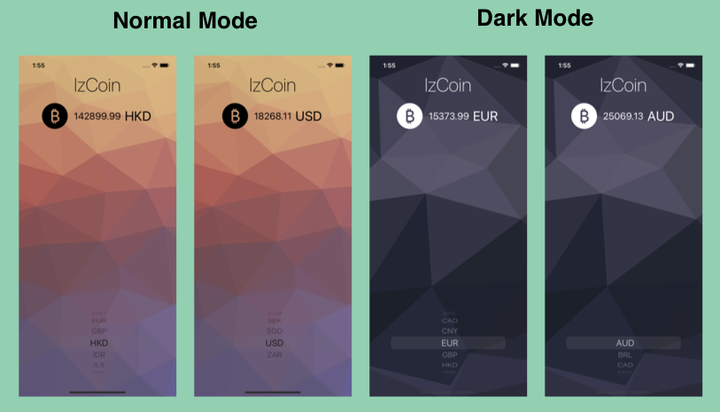

# izCoin

## Description

IzCoin is a easy and reliable way to track the price of BitCoin in all the popular, traded currencies. The application retrieves live data from coin.api.io by making a HTTP requests with URLSessions and Parse JSON with the native JSONDecoder. This application is using the SF Symbols provided by apple in ios13 along with the new Dark Mode feature.

## Screenshot

## Demo

