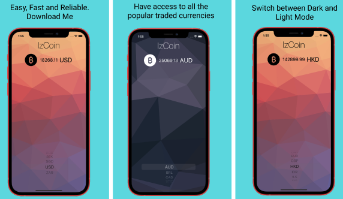

# izCoin
## QR Code | App Icon 
#### Scan QR-Code to head to the App store.

 ||               

## Overview
IzCoin is a easy and reliable way to track the price of BitCoin in all the popular, traded currencies. The application retrieves live data from coin.api.io by making a HTTP requests with URLSessions and parsing the JSON Data with the native JSONDecoder. This application is using the SF Symbols provided by Apple in ios13 along with the new Dark Mode feature.

## Tech
• Applied proper MVC structure, built with UIKit and Interface Builder UI.
• I retrieve live data from coin.api.io by making a HTTP request with URLSessions and parsing the JSON Data with the native JSONDecoder. 
• This application incorporates the SF Symbols provided by Apple in iOS13 alongside the new Dark Mode capabilities with the use of Vector Assets.

## Screenshot

## Demo

<!-- ## Scan QR-Code 
 -->
